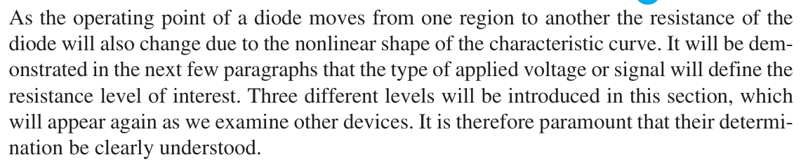
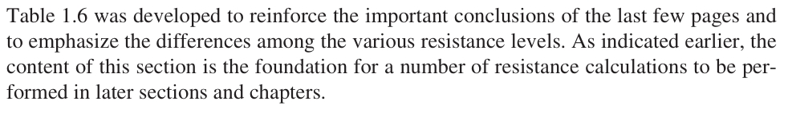

# 1.8 RESISTANCE LEVELS 

|  |
| :---: |
| **DC or Static Resistance**  |
|   |
|   |
|   |
|   |
|   |
|   |
|   |
|   |
|   |
| **AC or Dynamic Resistance**  |
|   |
|   |
|   |
|   |
|   |
|   |
|   |
|   |
|   |
|   |
|   |
|   |
|   |
|   |
|   |
|   |
|   |
|   |
|   |
|   |
|   |
|   |
|   |
|   |
| **Average AC Resistance**  |
|   |
|  |
|   |
|   |
|   |
| **Summary Table**  |
|   |
|   |
