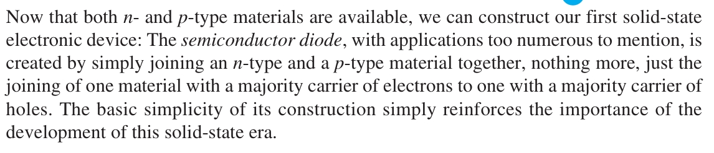
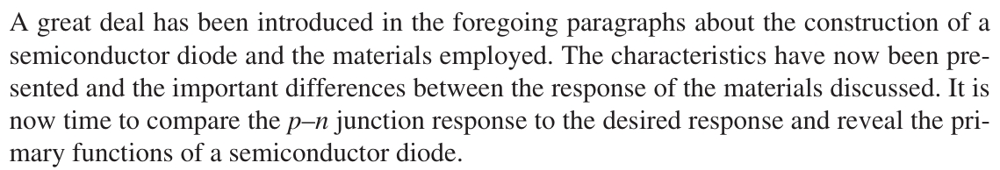
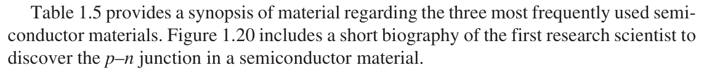

# 1.6 Semiconductor Diode

|  |
| :---: |
| **No Applied Bias (V = 0 V)** |
|  /1.jpeg) |
|  /2.jpeg) |
|  /3.jpeg) |
|  /4.jpeg) |
|  /5.jpeg) |
|  /6.jpeg) |
|  /7.jpeg) |
|  /8.jpeg) |
| **Reverse-Bias Condition ($V_D$ < 0 V)** |
| /1a.jpeg) |
| /1b.jpeg) |
| /2.jpeg) |
| /3.jpeg) |
| /4.jpeg) |
| **Forward-Bias Condition ($V_D$ > 0 V)** |
| /1.jpeg) |
| /2a.jpeg) |
| /2b.jpeg) |
| /3.jpeg) |
| /4.jpeg) |
| /5.jpeg) |
| /6.jpeg) |
| /7.jpeg) |
| /8.jpeg) |
| /9.jpeg) |
| /10.jpeg) |
| /11.jpeg) |
| /12.jpeg) |
| /13.jpeg) |
| /14.jpeg) |
| /15.jpeg) |
| /16.jpeg) |
| /17.jpeg) |
| /18.jpeg) |
| /19.jpeg) |
| /20.jpeg) |
| /21.jpeg) |
| /22.jpeg) |
| **Breakdown Region** |
|  |
|  |
|  |
|  |
|  |
|  |
|  |
|  |
| **Ge, Si and GaAs** |
|  |
|  |
|  |
|  |
|  |
|  |
|  |
|  |
|  |
| **Temperature Effects** |
|  |
|  |
|  |
|  |
|  |
|  |
|  |
|  |
| **Summary** |
|  |
|  |
|  |
|  |
  
