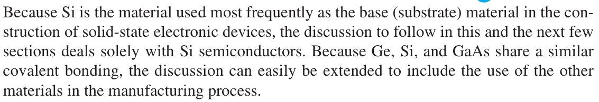
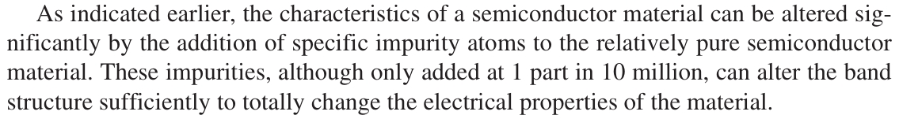
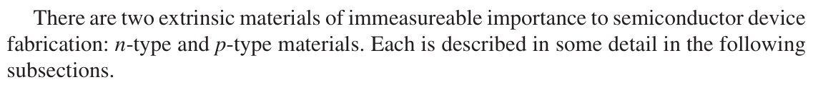

# 1.5 n-Type and p-Type Materials

|  |
| :---: |
|  |
|  |
|  |
| [**n-Type Material**]() |
|  |
||
|  |
|  |
| |
| [**p-Type Material**]() |
|  |
|   |
|  |
| [**Electron versus Hole Flow**]() |
|  |
|  |
| [**Majority and Minority Carriers**]() |
|  |
|  |
|  |
|  |
|  |
|  |
|  |

