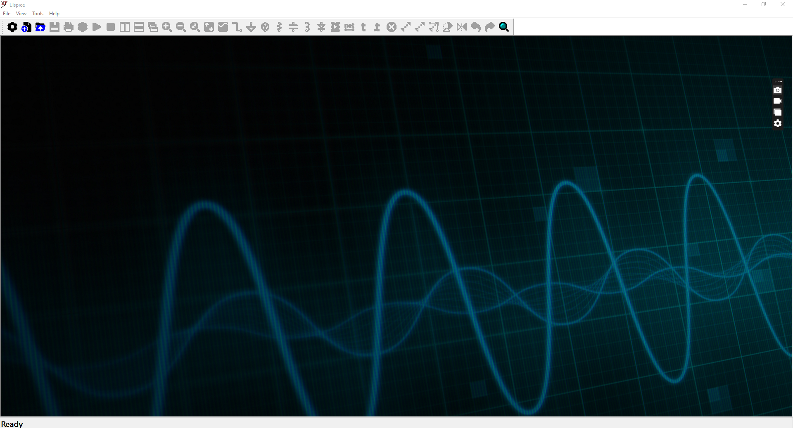
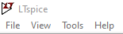
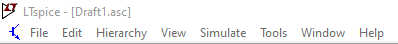
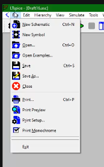
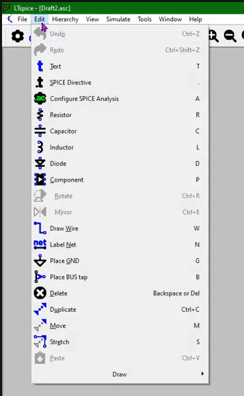
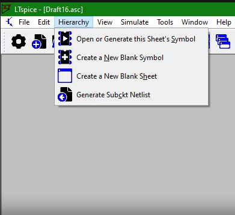
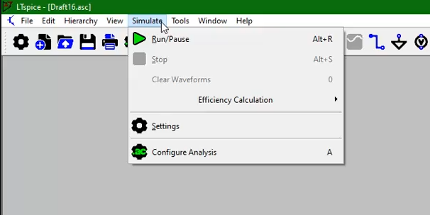
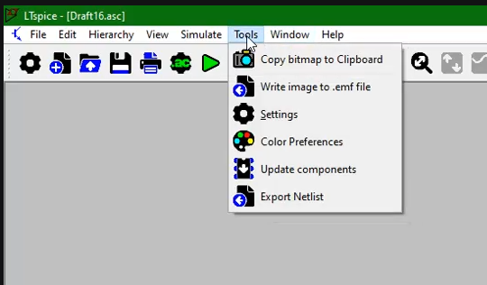
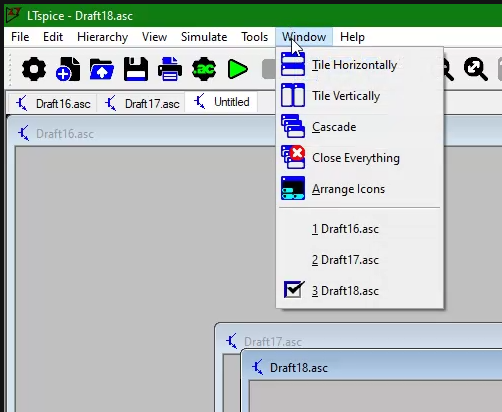
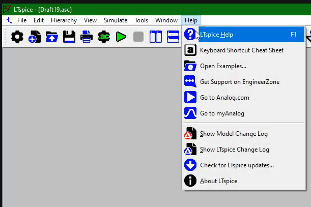

# User Guide

### Why I Doing this User Guide ?
>  For my learning and understanding purpose or to Make (other Human Species or Robots Species or any species) do this automatically, without any human need. 

> Due to the timeline, I analysis using Chatgpt, Gemini, Deepseek AI. [My Chat with Chatgpt for this below image timeline analysis](https://chatgpt.com/share/6a098955-d190-8323-ac58-8d3dbc25dca5)

### Step 1

| Step 1.1 : Open LTspice  | <video width="500 px" controls src="../ltspice_gui_images_and_videos/1.mp4"></video> | 
| --- |  :--- |
| Step 1.2 : Initial Window |  |

---

### Step 2

| Step 2.1 : MenuBar - Before Schematics |  | 
| --- |  :--- |
| Step 2.2 : MenuBar - After New Schematics |  |
| Step 2.3 : Menu - Individual MenuItem  | <video controls src="../ltspice_gui_images_and_videos/menu/menu.mp4"></video>|

  
| Menu | Image | Video |
| ---  | :---  | :--- |  
| File |  |<video width="500 px" controls src="../ltspice_gui_images_and_videos/menu/file.mp4"></video>|
| Edit |  |<video width="500 px" controls src="../ltspice_gui_images_and_videos/menu/edit.mp4"></video>|
| Hierarchy |   |<video width="500 px" controls src="../ltspice_gui_images_and_videos/menu/hierarchy.mp4"></video>|
| View | |<video width="500 px" controls src="../ltspice_gui_images_and_videos/menu/view.mp4"></video>|
| Simulate| |<video width="500 px" controls src="../ltspice_gui_images_and_videos/menu/simulate.mp4"></video>|
| Tools ||<video width="500 px" controls src="../ltspice_gui_images_and_videos/menu/tools.mp4"></video>|
| Window ||<video width="500 px" controls src="../ltspice_gui_images_and_videos/menu/window.mp4"></video>|
| Help | |<video width="500 px" controls src="../ltspice_gui_images_and_videos/menu/help.mp4"></video>|

---

### Step 3

|Step 3.1 : Toolbar |   | 
| --- | --- |
| Step 3.2 : Toolbar - Individual Component  | <video controls src="../ltspice_gui_images_and_videos/toolbar/toolbar.mp4"></video> |

---

