# User Guide

### Why I Doing this User Guide ?
>  For my learning and understanding purpose or to Make (other Human Species or Robots Species or any species) do this automatically, without any human need. 

> Due to the timeline, I analysis using Chatgpt, Gemini, Deepseek AI. [My Chat with Chatgpt for this below image timeline analysis](https://chatgpt.com/share/6a098955-d190-8323-ac58-8d3dbc25dca5)

# 1. Initial Screen

| Step 1.1 : Open LTspice  | <video width="500 px" controls src="../ltspice_gui_images_and_videos/1.mp4"></video> | 
| --- |  :--- |
| Step 1.2 : Initial Window |  |

---

# 2. Menubar

| Step 2.1 : MenuBar - Before Schematics |  | 
| --- |  :--- |
| Step 2.2 : MenuBar - After New Schematics |  |
| Step 2.3 : Menu - Individual MenuItem  | <video controls src="../ltspice_gui_images_and_videos/menu/menu.mp4"></video>|

---

## Menus 

| Menu | Image | Video |
| ---  | :---  | :--- |  
| File |  |<video width="500 px" controls src="../ltspice_gui_images_and_videos/menu/file.mp4"></video>|
| Edit |  |<video width="500 px" controls src="../ltspice_gui_images_and_videos/menu/edit.mp4"></video>|
| Hierarchy |   |<video width="500 px" controls src="../ltspice_gui_images_and_videos/menu/hierarchy.mp4"></video>|
| View | 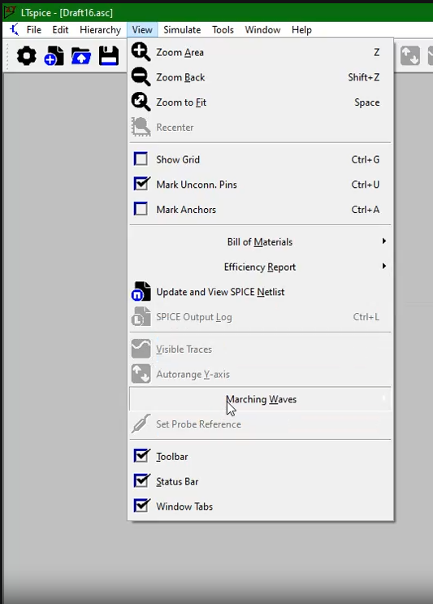|<video width="500 px" controls src="../ltspice_gui_images_and_videos/menu/view.mp4"></video>|
| Simulate| |<video width="500 px" controls src="../ltspice_gui_images_and_videos/menu/simulate.mp4"></video>|
| Tools ||<video width="500 px" controls src="../ltspice_gui_images_and_videos/menu/tools.mp4"></video>|
| Window ||<video width="500 px" controls src="../ltspice_gui_images_and_videos/menu/window.mp4"></video>|
| Help | |<video width="500 px" controls src="../ltspice_gui_images_and_videos/menu/help.mp4"></video>|

---

# Toolbar

|Step 3.1 : Toolbar |   | 
| --- | --- |
| Step 3.2 : Toolbar - Individual Component  | <video controls src="../ltspice_gui_images_and_videos/toolbar/toolbar.mp4"></video> |

--- 

## Tools 

| S.No | key Ctrl | Component | Logo | Image | Video|
| --- | --- | ---   | ---  | :---  | :--- |  
| 1 | | Settings |  | 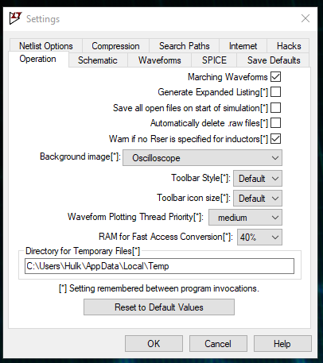 | <video width="500 px" controls src="../ltspice_gui_images_and_videos/2.settings.mp4"></video>|
| 2| Ctrl + N | New Schematics |  | 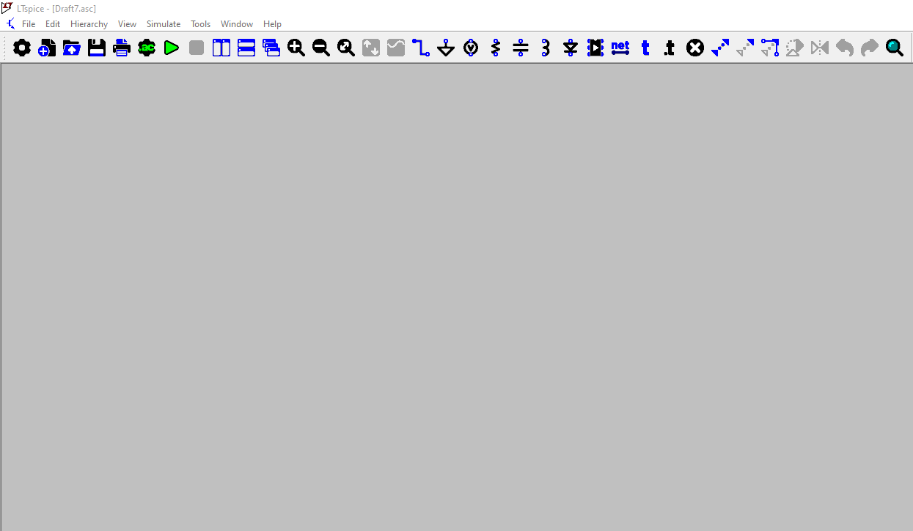 | <video width="500 px" controls src="../ltspice_gui_images_and_videos/new_schematic/1.mp4"></video>|
| 3| Ctrl + O | Open |  | | <video width="500 px" controls src="../ltspice_gui_images_and_videos/open/1.mp4"></video> |
| 4| Ctrl + S | Save |  | | |
| 5| Ctrl + P | Print |  | 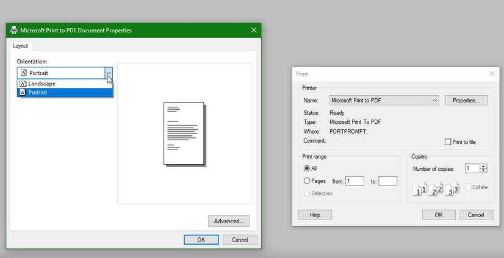  | <video width="500 px" controls src="../ltspice_gui_images_and_videos/print/print.mp4"></video>|
| 6| A | Configure Analysis |  |  | <video width="500 px" controls src="../ltspice_gui_images_and_videos/configure analysis/1.mp4"></video> |
| 7| Alt + R | Run/Pause Simulation |  | | <video width="500 px" controls src="../ltspice_gui_images_and_videos/toolbar/run.mp4"></video> |
| 8| Alt + S | Stop Simulation |  | | <video width="500 px" controls src="../ltspice_gui_images_and_videos/toolbar/run.mp4"></video> |
| 9|  | Tile Windows Vertically  |  | 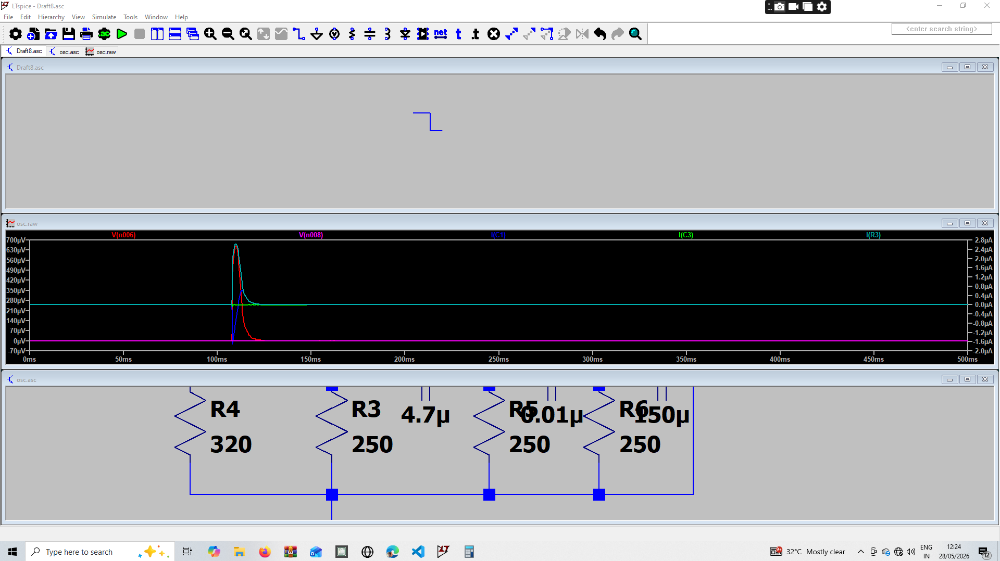 |  <video width="500 px" controls src="../ltspice_gui_images_and_videos/toolbar/tile and cascade window.mp4"></video> |
| 10|  | Tile Windows Horizontally |  | 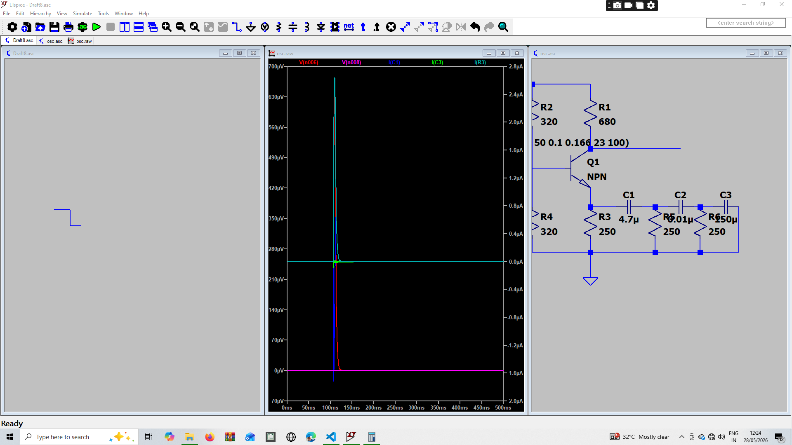  | <video width="500 px" controls src="../ltspice_gui_images_and_videos/toolbar/tile and cascade window.mp4"></video> |
| 11|  | Cascade Windows |  | 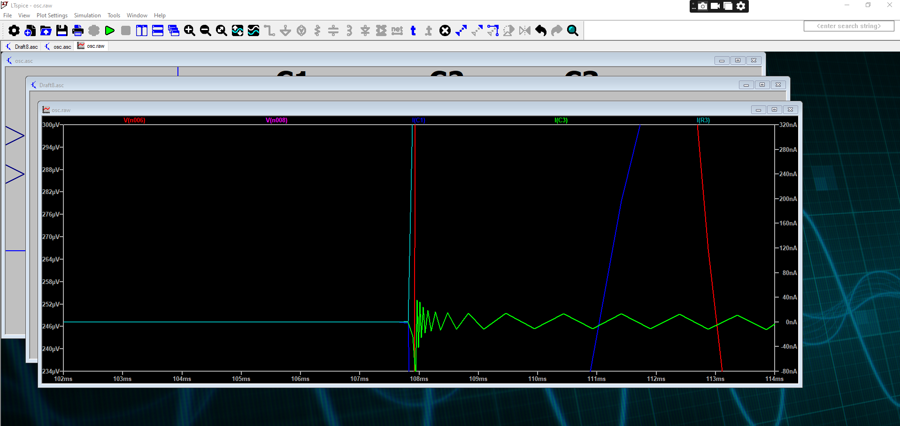 | <video width="500 px" controls src="../ltspice_gui_images_and_videos/toolbar/tile and cascade window.mp4"></video> |
| 12| Z | Zoom to rectangle |  | | <video width="500 px" controls src="../ltspice_gui_images_and_videos/toolbar/zoom.mp4"></video>  |
| 13| Shift + Z | Zoom back |  | | <video width="500 px" controls src="../ltspice_gui_images_and_videos/toolbar/zoom.mp4"></video>|
| 14| Space | Zoom to Fit |  | |<video width="500 px" controls src="../ltspice_gui_images_and_videos/toolbar/zoom.mp4"></video> |
| 15| Ctrl + Y | Autorange |  | | <video width="500 px" controls src="../ltspice_gui_images_and_videos/toolbar/autorange.mp4"></video> |
| 16|  | Pick Visibles Traces |  |  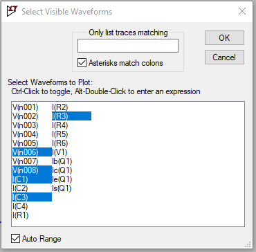 | <video width="500 px" controls src="../ltspice_gui_images_and_videos/toolbar/pick_visible_traces.mp4"></video> |
| 17| W | Wire |  |   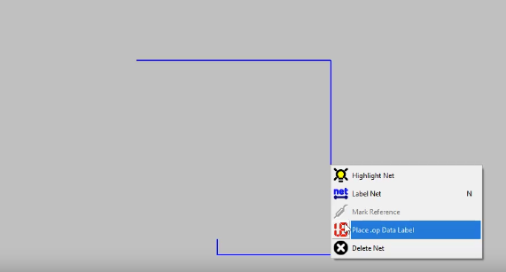 | <video width="500 px" controls src="../ltspice_gui_images_and_videos/toolbar/wire.mp4"></video> |
| 18| G | Ground |  | 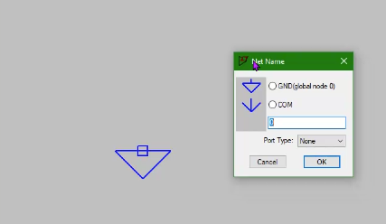 | <video width="500 px" controls src="../ltspice_gui_images_and_videos/toolbar/ground.mp4"></video> |
| 19| V | Voltage Source |  | 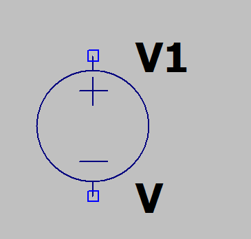| <video width="500 px" controls src="../ltspice_gui_images_and_videos/toolbar/voltage.mp4"></video> |
| 20| R | Resistor  |  |  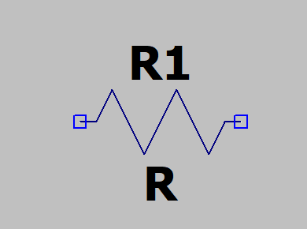 | <video width="500 px" controls src="../ltspice_gui_images_and_videos/toolbar/resistor.mp4"></video>|
| 21| C | Capacitor |  | 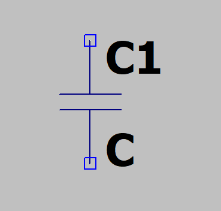 | <video width="500 px" controls src="../ltspice_gui_images_and_videos/toolbar/capacitor_C1.mp4"></video> |
| 22| L | Inductor |  |  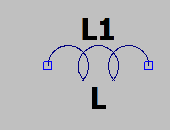 | <video width="500 px" controls src="../ltspice_gui_images_and_videos/toolbar/inductor.mp4"></video> |
| 23| D | Diode |  | 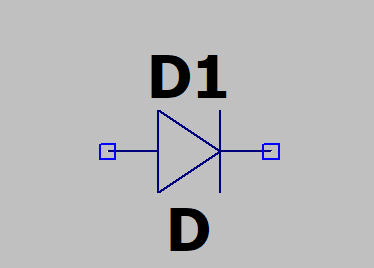 | <video width="500 px" controls src="../ltspice_gui_images_and_videos/toolbar/inductor.mp4"></video> |
| 24| P | Component |  | 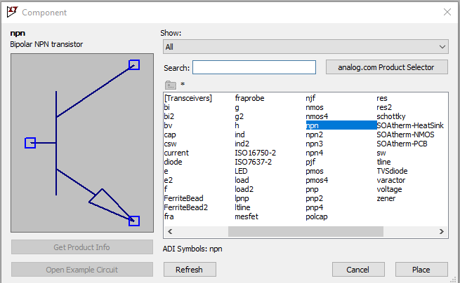 | <video width="500 px" controls src="../ltspice_gui_images_and_videos/toolbar/adc.mp4"></video> |
| 25| N | Label Net |  | 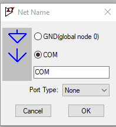 | <video width="500 px" controls src="../ltspice_gui_images_and_videos/toolbar/netlist.mp4"></video> |
| 26| T | Text |  | 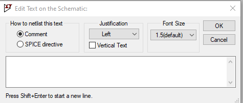 | <video width="500 px" controls src="../ltspice_gui_images_and_videos/toolbar/text.mp4"></video> |
| 27| .  | SPICE Derivative |  |  | <video width="500 px" controls src="../ltspice_gui_images_and_videos/toolbar/spice derivative.mp4"></video> |
| 28| Backspace or Del | Delete Mode  |  | | <video width="500 px" controls src="../ltspice_gui_images_and_videos/toolbar/delete.mp4"></video> |
| 29| Ctrl + C |  Duplicate Mode |  | | <video width="500 px" controls src="../ltspice_gui_images_and_videos/toolbar/duplicate.mp4"></video> |
| 30| Ctrl + M | Move Mode |  | | <video width="500 px" controls src="../ltspice_gui_images_and_videos/toolbar/move.mp4"></video> |
| 31 | Ctrl + S  | Stretch Mode  |  | |  <video width="500 px" controls src="../ltspice_gui_images_and_videos/toolbar/strectch.mp4"></video>  |
| 32 | Ctrl + R  | Rotate  |  | |  <video width="500 px" controls src="../ltspice_gui_images_and_videos/toolbar/rotate.mp4"></video>  |
| 33 | Ctrl + E | Mirror  |  | | <video width="500 px" controls src="../ltspice_gui_images_and_videos/toolbar/mirror.mp4"></video> |
| 34 | Ctrl + Z   | Undo  |  | | <video width="500 px" controls src="../ltspice_gui_images_and_videos/toolbar/undo_and_redo.mp4"></video> |
| 35 | Ctrl + Shift + Z | Redo |  | | <video width="500 px" controls src="../ltspice_gui_images_and_videos/toolbar/undo_and_redo.mp4"></video> |
| 36 | Ctrl + F | Search |  | | |

---

